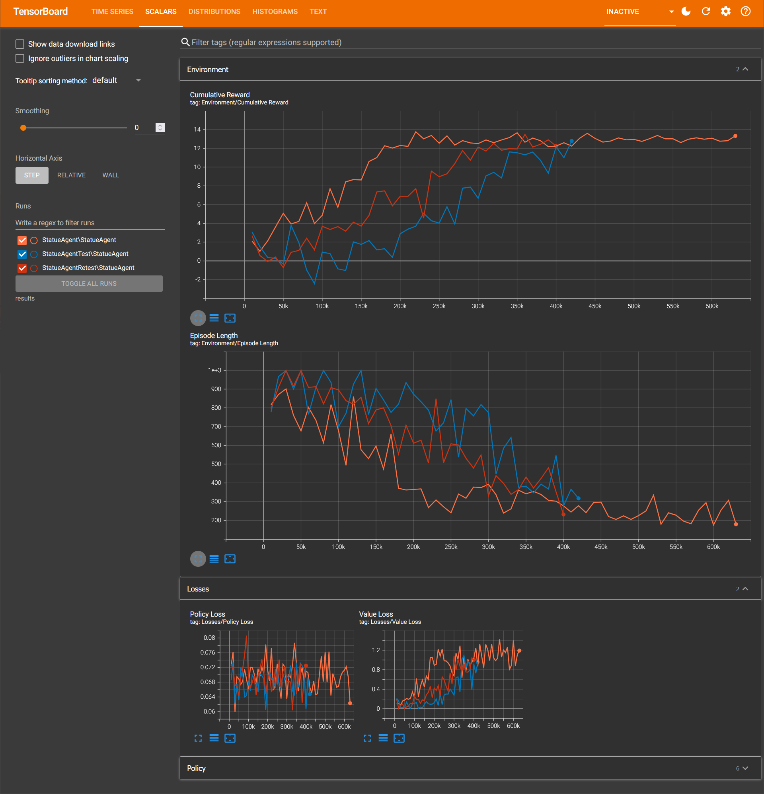

# Haunted Escape: VR Edition

Door: Vislan, Lowie, Stanley, Milan

## Inleiding

Een immersieve VR experience waarin AI-gestuurde standbeelden actief de speler zoekt terwijl die een uitweg zoekt uit een mysterieuze omgeving.

In dit document leer je hoe wij een AI-aangedreven VR-project opgezet hebben waarbij vijandige standbeelden de speler proberen te zoeken. Dankzij reinforcement learning leren de standbeelden zelfstandig optimale strategieën om de speler te detecteren en te benaderen. Aan het einde van deze handleiding kan je een werkende versie van het spel maken waarin gameplay, AI, en VR worden gecombineerd.

## Methoden

### Installatie

- Unity versie: **6 (6000.0.36f1)**
  - ML Agents: **3.0.0**
- Anaconda: **24.11.3**
  - Python omgeving: **3.9.18**
    - Torch: **1.7.1**
    - Protobuf: **3.20.\***
    - Mlagents: **0.30.0**

### Verloop van het spel

#### Introductie

Het spel begint wanneer de speler zich bevindt in een mistige, duistere omgeving. De lucht is zwaar en de maan schijnt slechts vaag door de wolken. In de verte staat een gebouw met een open deur. Gedreven door nieuwsgierigheid betreedt de speler het duistere interieur. Net wanneer hij binnenstapt, slaat de deur achter hem met een doffe klap dicht.

Het is zwartgallig donker, maar in de schaduw van de ruimte glinstert iets. In de hoek van de kamer ligt een zaklamp. De speler pakt hem op, het licht doorbreekt de duisternis, maar wanneer hij zich omdraait om de deur weer te openen, ontdekt hij dat deze op mysterieuze wijze op slot zit. De enige uitweg ligt daar, achter die deur. De speler weet dat hij geen andere keuze heeft: hij moet zich een weg banen door dit doolhof-achtige gebouw en een sleutel vinden om te ontsnappen.

#### AI-game mechanics

Doorheen het gebouw beweegt een AI-gestuurd standbeeld dat probeert de speler te zoeken. Wanneer het standbeeld de speler aanraakt dan is het game-over en moet de speler opnieuw beginnen. Wanneer een speler kijkt naar het standbeeld kan deze niet bewegen maar vanaf het moment dat de speler even wegkijkt dan kan het standbeeld wel bewegen.

De agent is getraind zonder dat het freeze mechanic van de agent werd gebruikt. Aangezien dat iets is dat absoluut moet gebeuren en makkelijk programmatisch kan worden toegevoegd is het efficiënter om dat niet te laten trainen.

### Observaties, acties en beloningen

**Observaties:**

- Eigen positie (transform.localPosition)
- Eigen kijkrichting (transform.forward)
- Ray Perception Sensor 3D (13 rays, 90°)
  - Detectable Tags (Player, wall)

**Acties (Discrete):**

- Beweging: niets, vooruit, achteruit
- Rotatie: niets, links, rechts

**Beloningen:**

- +0.05 voor het bezoeken van een nog niet bezochte locatie (locatie is afgerond op een volledig getal waardoor er een soort grid layout is)
- -0.02 bij botsing met muur
- +10.0 bij contact met speler
- -0.5 bij einde episode zonder speler te bereiken

### Beschrijving van de objecten

| Object          | Omschrijving                                             |
| --------------- | ---------------------------------------------------------|
| **Player**      | De speler, bestuurt zichzelf in VR                       |
| **StatueAgent** | AI-agent die de speler zoekt en zich beweegt             |
| **Wall**        | Muren die ervoor zorgen dat het gebouw doolhof-achtig is |
| **Key**         | Object dat de speler moet vinden om de deur te openen    |
| **Flashlight**  | Object dat de speler kan gebruiken voor verlichting      |
| **Door**        | De ingang en uitgang van het spel                        |

### Gedragingen van de objecten

| Object          | Gedrag                                                                                                                                                  |
| --------------- | --------------------------------------------------------------------------------------------------------------------------------------------------------|
| **Player**      | Beweegt en kijkt vrij in VR, kijkt naar standbeelden om deze tijdelijk te bevriezen, kan verschillende objecten gebruiken.                              |
| **StatueAgent** | Leert autonoom om zich naar de speler te bewegen zonder gezien te worden. Straf bij botsingen tegen muur, beloning bij exploratie en vinden van speler. |
| **Key**         | Moet gevonden en opgepakt worden door de speler; opent de deur.                                                                                         |
| **Flashlight**  | Kan opgepakt worden door de speler en zorgt voor verlichting.                                                                                           |
| **Door**        | Opent wanneer er een sleutel op wordt gebruikt.                                                                                                         |

### Informatie van de one-pager

- Weeping Angels bewegen autonoom en intelligent door reinforcement learning.
- VR verhoogt immersie: realistische beweging, kijkgedrag beïnvloedt gameplay.
- AI maakt gedrag van standbeelden onvoorspelbaar en dynamisch.

**Afwijking t.o.v. one-pager:**
De one-pager had enkel maar betrekking tot de ML agent terwijl er best wel wat rond komt kijken om een leuke game te maken; zoals: de mist, zaklamp, sleutel, etc...

In de one-pager werd ook niets vermeld dat het kijkmechanisme niet getraind zou worden maar gewoon nadien in code wordt gedaan.

## Resultaten

Onderstaande Tensorboard dashboard toont de resultaten van 3 trainingen die zijn uitgevoerd met exact dezelfde scripts, omgeving en configuratie.

### Beschrijving van de waarnemingen

**Cumulative Reward:**
We zien eerst een lichte daling waarna de waarde snel begint toe te nemen. Vanaf dat de waarde rond de 13 is begint het vrijwel meteen te stabiliseren.

Ook zien we dat de initiële daling bij iedere run anders is.

**Episode Length:**
Bij de episode length zien we eerst dat de initiële waarde rond de 800 is en daarna wat toeneemt tot maximaal 999 (dan wordt de episode beëindigd). Nadien zien we een sterke daling tot ongeveer 300 waarna er toch een blijvende lichte daling is.

**Policy Loss / Value Loss:**

De policy Loss blijft fluctueren tussen de 0.06 en 0.08.
De value Loss neemt hetzelfde patroon aan als de cumulative reward maar dan met een grotere relatieve schommeling.

### Opvallende waarnemingen (tijdens het trainen)

- Desondanks dat deze 3 trainingen op exact dezelfde manier zijn gemaakt is er toch een duidelijk verschil in de beginfase. De waarschijnlijke reden dat dit komt is omdat de agent soms geluk heeft met waar de player spawned in het begin. Als de speler meteen een aantal keer dicht bij de agent is dan leert die al snel wat het uiteindelijke doel is en wat een hoge reward geeft.

- Wanneer de cumulative reward gedaan is met de snelle stijging stabiliseert het zeer snel maar de episode length blijft wel lichtjes dalen. De reden waarom dit gebeurt, lijkt te zijn omdat de agent zich snel leert te navigeren doorheen het gebouw maar nog niet effectief genoeg is. Zo is te zien dat de uiteindelijke agent minder vaak bepaalde delen van het gebouw overslaat zoals doodlopende gangen waar de speler ook zich kan bevinden.

- Wanneer de agent getraind is en daarna da muren van het gebouw worden aangepast dan kan de agent hier perfect mee overweg. Wanneer je een doorgang blokkeert dan gaat de agent niet proberen hier door te gaan maar zoekt het gewoon verder waar het wel toegang tot heeft. Ook wanneer er een muur wordt weggehaald dan maakt de agent hier meteen gebruik van om nieuwe locaties te zoeken. Dit toont toch wel aan dat de agent niet zomaar de layout heeft zitten leren maar echt heeft leren kijken met zijn rays.

- Het aanpassen van de rewards of wanneer de episode eindigt heeft vaak een grote impact op het verloop van de training. b.v.:

  1. Het nog verlagen van de negatieve reward wanneer de agent tegen een muur loopt zorgt ervoor dat de agent niet door smalle doorgangen gaat en in zijn beginzone blijft. Het verhogen zorgt er dan weer voor dat de agent niet snel genoeg leert dat tegen een muur botsen niet goed is.

  2. De balans tussen de reward dat de agent krijgt wanneer het een niet bezochte locatie bezoekt en wanneer het de speler aanraakt is ook zeer belangrijk. Wanneer deze rewards niet in balans waren dan ging de agent actief de speler ontwijken om verder rewards te sprokkelen doorheen het gebouw om daarna pas naar de speler te gaan.

  3. De limiet van de step count is ook zeer belangrijk. Wanneer deze limiet er niet is dan leert de agent niets bij en blijft die meestal gewoon in een hoek spartelen. Ook de grafieken worden dan niet gemaakt omdat er dan geen data is.

## Conclusie

In dit project hebben we een VR-game gemaakt waarin een AI-gestuurd standbeeld de speler probeert te vinden door gebruik te maken van reinforcement learning.

Wat we vooral gezien hebben is dat de agent redelijk snel leert om de speler te vinden, zolang de beloningen goed in balans zijn. De training zorgt er uiteindelijk voor dat de agent vlot door het gebouw kan navigeren en niet blijft hangen in bepaalde zones. Moesten we de layout van het level veranderen, past de agent zich hier moeiteloos aan deze situatie aan, wat wel aantoont dat hij niet gewoon vaste routes heeft geleerd maar echt kijkt met zijn sensors.

Persoonlijk vinden we dat de resultaten laten zien dat een AI-agent heel goed bruikbaar is voor dit soort vijand-gedrag. Het feit dat je het standbeeld nooit op exact dezelfde manier ziet bewegen doorheen het gebouw maakt het spel veel spannender en minder voorspelbaar.

Voor de toekomst zou het zeker interessant zijn om meerdere standbeelden tegelijk te gebruiken en te kijken of we ze dan kunnen laten samenwerken om nog sneller de speler te vinden. Ook zou het handig kunnen zijn om het kijkmechanisme misschien toch gedeeltelijk mee te nemen in de training, zodat het gedrag nog beter aansluit bij de gameplay. Verder zou het toevoegen van geluid waarbij de agent dan de speler hoort aankomen ook nog iets zijn dat de game naar een hoger niveau zou kunnen tillen.

## Referenties

-	Peeters, Tom (2022), mlagents_2223-deel1 , AP Hogeschool.
-	Peeters, Tom (2022), mlagents, AP Hogeschool.

